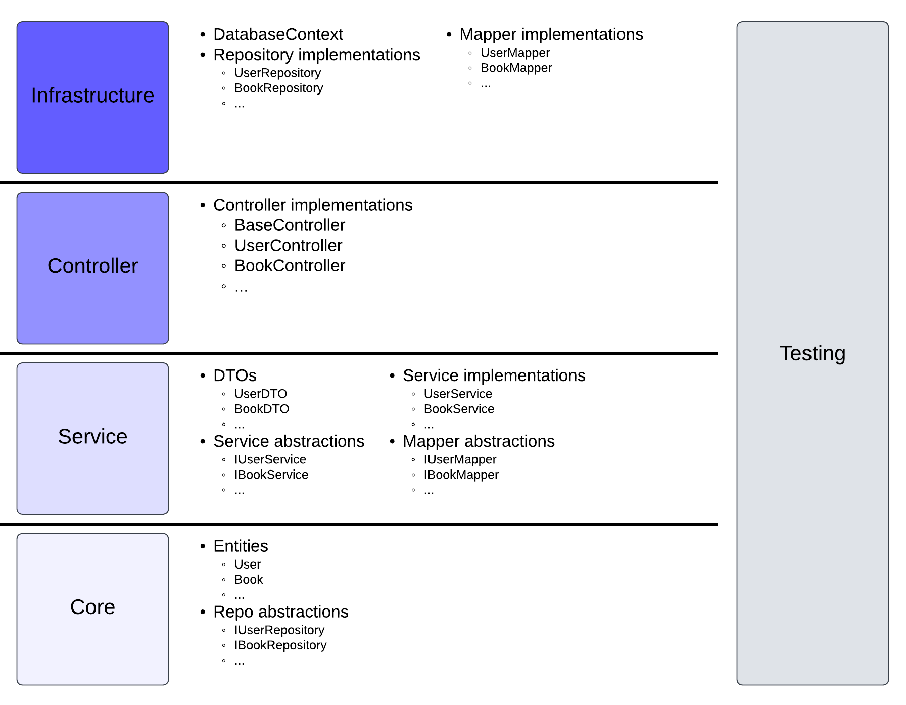
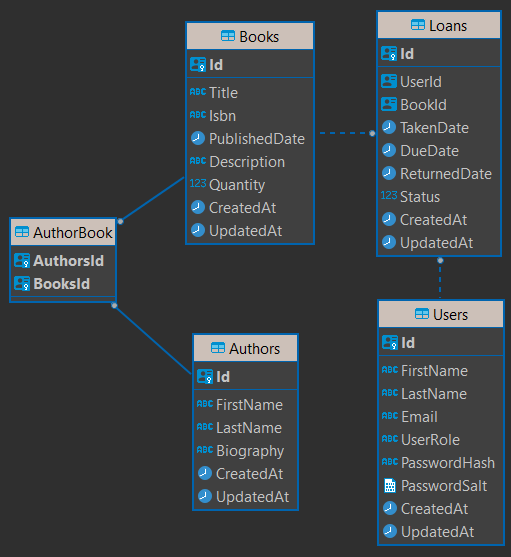
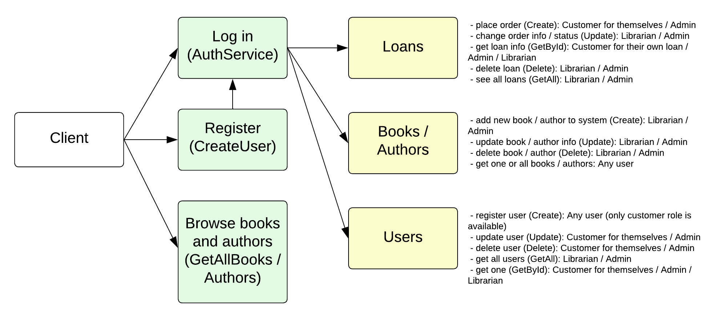

# Fullstack Project

Welcome to Library management system!
This is a fullstack project that allows a user to interact with a library. It works with a ASP.NET Core backend and React frontend.

Below you can find several diagrams which describe the projects structure and design.

## Table of Contents

1. [Mandatory features](#mandatory-features)
2. [Requirements](#requirements)
3. [Diagrams](#diagrams)
4. [Testing](#testing)

## Mandatory features

#### User Functionalities

1. ✅ (authorization and authentication supported, first admin is inserted directly into database) User Management: Users should be able to register for an account and log in. Users cannot register themselves as admin.
2. ✅ (anyone can get all or individual books and authors) Browse Products: Users should be able to view all available products and single product, search and sort products.
3. ⏳ (**todo** in frontend part) Add to Cart: Users should be able to add products to a shopping cart, and manage cart.
4. ✅ (users can create their own book loan) Checkout: Users should be able to place order.

#### Admin Functionalities

1. ✅ User Management: Admins should be able to view and delete users.
2. ✅ Product (Book) Management: Admins should be able to view, edit, delete and add new products (books).
3. ✅ Order (Loan) Management: Admins should be able to view all orders (loans)

## Requirements

1. ✅ Apply CLEAN architecture in your backend. In README file, explain the architecture of your project as well.
2. ⏳ (**in progress**) Implement Error Handling Middleware: This will ensure any exceptions thrown in your application are handled appropriately and helpful error messages are returned.
3. ✅ Document with Swagger: Make sure to annotate your API endpoints and generate a Swagger UI for easier testing and documentation.
4. ✅ Project should have proper file structure, naming convention, and comply with Rest API.
5. ✅ `README` file should sufficiently describe the project, as well as the deployment.

### Diagrams

#### Clean Architecture

#### Database ERD

#### CRUD Permissions and expected client interactions

### Testing

**in progress**
